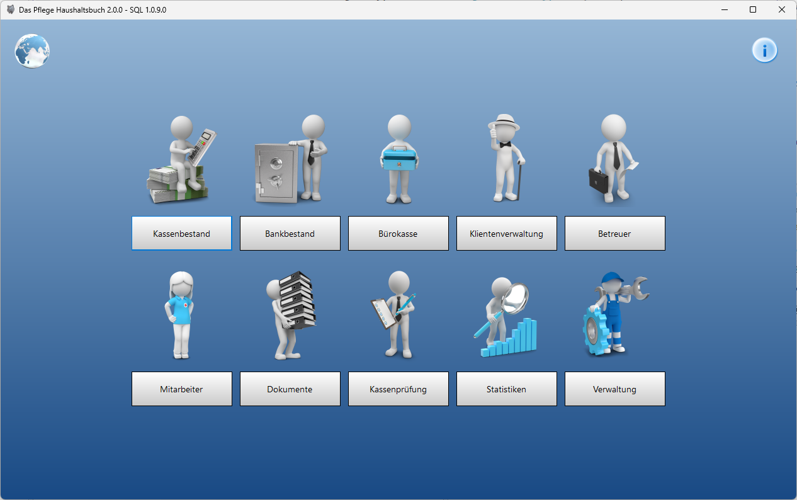
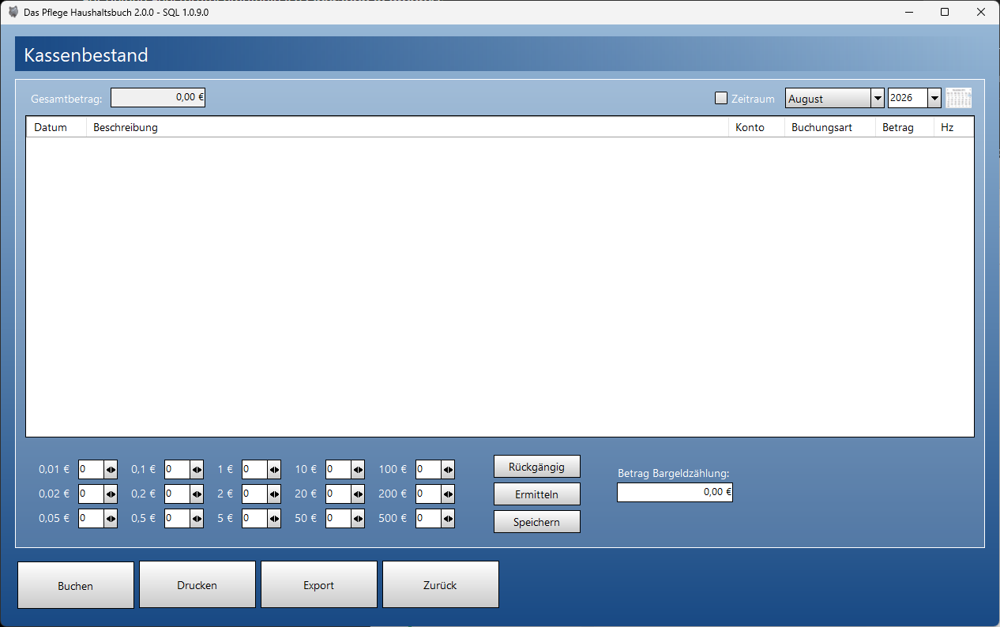
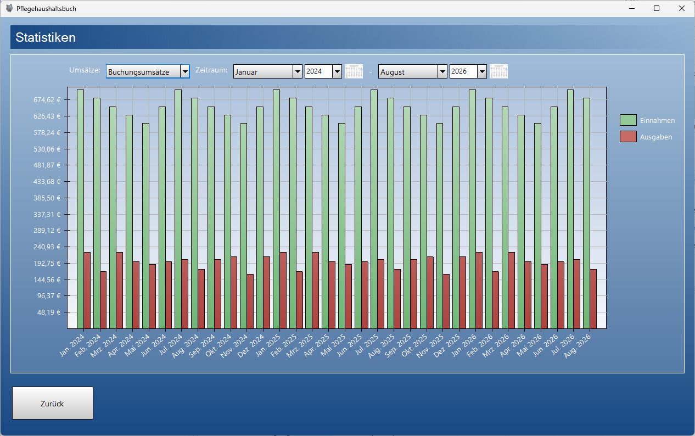

# Pflegehaushaltsbuch

Pflegehaushaltsbuch ist eine Windows-Desktopanwendung für ambulante Pflege- und Betreuungsdienste. Die Anwendung unterstützt die Verwaltung von Klienten, Betreuern, Mitarbeitern, Verwahrgeld, Kassen- und Bankbewegungen, Dokumenten, Drucklayouts und Auswertungen. Sie ist historisch gewachsen, wird aktuell auf .NET Framework 4.8 betrieben und setzt auf Windows Forms mit eigenen Controls, mehrsprachige `.resx`-Ressourcen und mehrere Datenbank-Backends.

Zentraler Zugriff auf alle Funktionen des Pflegehaushaltsbuchs.



### Kassenbestand

Erfassung und Verwaltung von Einnahmen, Ausgaben und Kassenbeständen.



### Statistiken

Auswertung der finanziellen Entwicklung nach Zeitraum und Buchungsart.



## Funktionsüberblick

- Klienten, Betreuer, Mitarbeiter und Stammdaten verwalten
- Barbestand, Bankbestand, Verwahrgeld, Bargeldzählung und Kassenbuchungen erfassen
- Umbuchungen, Auszahlungen, Einzahlungen, Stornos und Journal-Einträge abbilden
- Benutzer, Rechte und Administratorfunktionen verwalten
- Datenbanken erstellen, verbinden, aktualisieren, sichern und wiederherstellen
- SQL Server, MySQL und SQLite (letzteres nur zum Testen) als Datenbankziele unterstützen
- Dokumente, Quittungen, Buchungslisten und Auswertungen drucken oder exportieren
- Layouts für Druckdokumente bearbeiten, importieren, exportieren und zurücksetzen
- Fristen, Termine, Monatskalender und Auswertungen anzeigen
- Mehrsprachige Oberflächen über neutrale und lokalisierte `.resx`-Dateien bereitstellen

## Technischer Steckbrief

| Bereich | Stand |
| --- | --- |
| Anwendungstyp | Windows Desktop / WinForms |
| Ziel-Framework | .NET Framework 4.8 |
| Projektformat | klassisches MSBuild-Projekt mit `packages.config` |
| Hauptassembly | `Pflegehaushaltsbuch.exe` |
| Einstiegspunkt | `Program.Main()` startet `Forms.MDI` |
| UI-Technologie | Windows Forms mit eigenen `FormControls` |
| Datenbanken | Microsoft SQL Server, MySQL, SQLite |
| Lokalisierung | `.resx` mit Unterstützung für Deutsch, Englisch, Türkisch und Russisch |
| Tests | MSTest für Logik-/Datenbanktests, NUnit/FlaUI für UI-Smoke-Tests |
| Lizenz | GNU Affero General Public License v3.0, siehe `LICENSE.txt` |

## Architektur

Die Anwendung ist in mehrere fachliche und technische Bereiche aufgeteilt.

### Anwendungseinstieg

`Program.cs` initialisiert die Anwendung, setzt Standardpfade, Farben, Schriften, UI-Kompatibilität und Kulturinformationen. Ist in den Einstellungen keine Sprache gesetzt, verwendet die Anwendung die installierte UI-Kultur des Betriebssystems. Danach wird die MDI-Hauptoberflaeche gestartet.

Wichtige Startaufgaben:

- Dokumentpfad unter `Eigene Dokumente\Pflegehaushaltsbuch` vorbereiten
- globale Farb- und Font-Einstellungen setzen
- `CurrentCulture` und `CurrentUICulture` anhand der App-Einstellung oder OS-Kultur setzen
- `Forms.MDI` als Hauptfenster starten

### Datenbankschicht

Die Datenbanklogik basiert auf `Databases.SQLBase`. Diese abstrakte Basisklasse definiert die gemeinsamen Operationen für Verbindungen, Adapter, Buchungen, Journalisierung, Updates, Backups und Wiederherstellung. Die konkreten Implementierungen liegen in:

- `Databases.SQL` für Microsoft SQL Server
- `Databases.MySQL` für MySQL
- `Databases.SQLITE` für SQLite

Zentrale Aufgaben der Datenbankschicht:

- Verbindung testen und herstellen
- Datenbanken erstellen oder löschen
- Tabellen und Views über Adapter füllen
- Änderungen aus `DataTable`-Instanzen zurückschreiben
- Buchungen für Barbestand, Bankbestand, Klientenbuch und Büro-/Kassenbuch erzeugen
- Datenbankversionen aktualisieren
- SQL-Skripte aus dem `Version`-Ordner ausführen
- Backups erzeugen und wiederherstellen
- Wiederherstellungen zunächst in eine neue Datenbank schreiben, damit die bestehende Datenbank erhalten bleibt
- Benutzer und Datenbankrechte verwalten

Die fachlichen Selects und Spaltennamen werden über Enums in `SQLBase` gebündelt. Dadurch verwenden Formulare und Dialoge keine frei verteilten Tabellen- oder Spaltennamen.

SQLite wird als lokale Test- und Einzelplatzdatenbank behandelt. Beim Erstellen einer SQLite-Datenbank verwendet die Anwendung den festen Pfad `Appdata\Local\Richter Pflegehaushaltsbuch\Verwahrgeld.db`. Dieser Speicherort ist benutzerbezogen und nicht für mehrere gleichzeitig angemeldete Windows-Benutzer gedacht. Für produktiven Mehrbenutzerbetrieb sollten SQL Server oder MySQL verwendet werden.

### Fachliche Datenmodelle

Der Ordner `Data` enthält zentrale Daten- und Hilfsklassen:

- `Company` verwaltet Firmen- und Kontaktdaten inklusive E-Mail-Validierung.
- `User` beschreibt lokale Benutzerinformationen.
- `ID_Client_Data` kapselt Klienten-IDs und zugehörige Namen.
- `DocumentLayer` beschreibt serialisierbare Dokumentseiten und Seitennummern.
- `Printing` verwaltet Drucklayouts, Variablen, Layoutimport, Layoutexport und Layout-Reset.
- `Excel` kapselt Excel-bezogene Export- und Interop-Funktionen.
- `Licensing` prüft Lizenzdaten gegen die Datenbank.

Die Unterordner `Data\Graphics` und `Data\Print` bilden die Druck- und Layoutlogik ab. `GraphicsItem` ist die gemeinsame Basis für grafische Elemente wie Text, Linien, Rechtecke, Bilder und Tabellen. `PrintBase` stellt den gemeinsamen Druckablauf bereit, während `Quittance` die Quittungslogik darauf aufsetzt.

### Oberflaeche

Die Fenster liegen im Ordner `Forms`. Viele davon erben von `Pflegehaushaltsbuch.FormControls.Form`, damit Farben, Schriftgrössen, Layoutverhalten und gemeinsame UI-Funktionen zentral gesteuert werden.

Die meisten fachlichen Fenster und Dialoge folgen inzwischen einem MVP-Muster:

- Views bleiben in den WinForms-Klassen unter `Forms` und enthalten UI-Bindings, Dialogerzeugung, MessageBoxen und Control-Zugriffe.
- View-Contracts liegen unter `Forms\Contracts` und beschreiben, welche UI-Aktionen ein Presenter auslösen darf.
- Presenter liegen unter `Forms\Presenters` und steuern Validierung, Datenbankaufrufe, Navigation und längere Workflows.
- Gemeinsamer Datenbankzustand wird über `Databases.SqlSession` weitergereicht, statt von Formularen direkt global abgefragt zu werden.
- Lange Datenbankoperationen verwenden Progress-Contracts, damit Dialoge weiterhin von der View erzeugt und vom Presenter nur gesteuert werden.

Diese Trennung ist nicht in jedem historischen Formular gleich tief, bildet aber die bevorzugte Struktur für neue Änderungen.

Wichtige Formularbereiche:

- `MainMenuForm`, `MDI` und `AdministrationForm` für Navigation und Hauptbereiche
- `UserLoginForm`, `CreationUserForm`, `ChangeUserForm` und `UserManagerForm` für Benutzerverwaltung
- `ClientsForm`, `AdvisorForm`, `AssistantsForm` und zugehörige Dialoge für Stammdaten
- `BookForm`, `CashForm`, `BankForm`, `OfficeCashForm` und Buchungsdialoge für Finanzbewegungen
- `DatabaseManagerForm`, `DatabaseFileForm`, `DatabaseServerConnectForm`, `DatabaseUpdateForm` und `CreateSQLUser` für Datenbankverwaltung
- `DocumentsForm`, `LayoutManager`, `PageSettingsForm` und Druckdialoge für Dokumentlayouts
- `DeadLinesForm`, `ChangeDeadlineForm`, `StatisticsForm` und Kalenderdialoge für Auswertungen und Fristen

Die Dialoge unter `Forms\Dialoge` decken Erstellen, Bearbeiten, Importieren, Drucken, Zurücksetzen und spezielle Workflows wie Rückzahlungen oder Datenbankupdates ab.

### Eigene Controls

Der Ordner `FormControls` erweitert Standard-WinForms-Controls um ein konsistentes Verhalten für Darstellung, Farben, Eingaben und Layouts.

Beispiele:

- `Form` als gemeinsame Basis für Anwendungsfenster
- `Button`, `Label`, `TextBox`, `ComboBox`, `ListBox`, `DataGridView` und weitere Wrapper um Standardcontrols
- `DateTimeBox` und `NumericUpDown` mit Property-Change-Unterstützung
- `Layout` und `GeometryControl` für visuelle Layout- und Zeichenelemente
- `PrintPreviewDialog` für angepasste Druckvorschau
- `MessageBox` als eigene Dialogbasis
- `EmbededForm` für eingebettete Fensterdarstellung

### Sicherheit

Die Anwendung enthält zwei moderne Sicherheitsbausteine für sensible Daten:

- `PasswordHasher` verwendet PBKDF2-SHA256 mit Salt und Iterationen für neue Passwort-Hashes.
- Legacy-MD5-Hashes werden weiterhin erkannt, können aber über `NeedsRehash` als migrationsbedürftig markiert werden.
- Nach mehreren fehlgeschlagenen Login-Versuchen wird das Benutzerkonto temporär gesperrt; nach erfolgreichem Login werden Fehlversuche und Sperrstatus zurückgesetzt.
- `CredentialProtector` schützt lokal gespeicherte Zugangsdaten über Windows DPAPI und kennzeichnet geschützte Werte mit einem Versionspräfix.
- Datenbankoperationen in den Formularen werden gegen parallele Doppelstarts abgesichert, damit die Oberflaeche reaktionsfähig bleibt und Verbindungen nicht gleichzeitig mehrfach benutzt werden.
- SQL-Werte werden über Parameter übergeben; dynamische Identifier werden validiert, bevor sie in SQL verwendet werden.

Diese Funktionen sind durch Tests abgedeckt.

### Lokalisierung

Mehrsprachigkeit wird über `.resx`-Dateien umgesetzt. Unterstützt werden Deutsch, Englisch, Türkisch und Russisch. Die neutralen Ressourcen enthalten die englischen Standardtexte, lokalisierte Dateien enthalten die jeweilige Sprache.

Beispiele:

- `Messages.resx` enthält neutrale englische Meldungstexte und erzeugt `Messages.Designer.cs`.
- `Messages.de.resx` enthält deutsche Meldungstexte.
- Türkische und russische Ressourcen liegen als `.tr.resx` und `.ru.resx` parallel zu den bestehenden neutralen und deutschen Ressourcen vor.
- `EnumResources.resx` enthält neutrale Enum-Anzeigetexte und erzeugt `EnumResources.Designer.cs`.
- `EnumResources.de.resx` enthält deutsche Enum-Anzeigetexte.
- Formularressourcen liegen als `FormName.resx`, `FormName.de.resx` und teilweise `FormName.en.resx` vor.

Beim Build erzeugt `BuildSatelliteAssemblies.ps1` Satellitenassemblies für alle lokalisierten Ressourcen, die im Projekt enthalten sind. Aktuell sind `de`, `tr` und `ru` als Satellite-Sprachen eingetragen. Die Anwendung verwendet beim Start entweder die explizit gespeicherte Sprache oder, wenn diese leer ist, die installierte UI-Kultur des Betriebssystems.

Ein vollstaendiger Sprachwechsel zur Laufzeit ist derzeit nicht vorgesehen. Einige Ausgaben werden dynamisch zusammengesetzt und dabei mit Laufzeitwerten wie Namen, Betraegen, Zeiträumen oder Datenbankinformationen ergänzt. Diese Texte kommen daher nicht immer direkt und unverändert aus einer `.resx`-Datei. Eine geänderte Sprache wird deshalb erst nach einem Neustart der Anwendung verlässlich auf alle Oberflächen- und Meldungstexte angewendet.

Regeln für neue Resource-Eintraege:

1. Neue Keys immer in der neutralen `.resx` anlegen.
2. Übersetzungen in den jeweiligen Sprachspalten oder Sprachdateien ergänzen.
3. Nur neutrale `.resx`-Dateien dürfen einen `Designer.cs` erzeugen.
4. Lokalisierte Dateien wie `.de.resx` dürfen keinen `Generator` und kein `LastGenOutput` haben.

## Wichtige Abhaengigkeiten

Die NuGet-Pakete werden über `packages.config` verwaltet. Wichtige Bibliotheken sind:

- Entity Framework 6
- Microsoft.Data.SqlClient
- MySqlConnector
- System.Data.SQLite
- PDFsharp
- Microsoft Office Interop für Excel und Outlook
- System.Text.Json und moderne Microsoft.Extensions-Pakete
- System.Resources.Extensions für Ressourcenerzeugung im aktuellen Build

## Build

Voraussetzungen:

- Windows
- .NET Framework 4.8 Developer Pack
- Visual Studio oder MSBuild Build Tools
- NuGet-Paketwiederherstellung für `packages.config`

Mit der Solution-Datei:

```powershell
dotnet build Pflegehaushaltsbuch.slnx
```

Alternativ mit MSBuild:

```powershell
msbuild Pflegehaushaltsbuch.csproj /p:Configuration=Debug /p:Platform="AnyCPU"
```

Beim Build werden die lokalisierten Satellitenassemblies automatisch erzeugt.

Hinweis: Wenn die Anwendung gerade laeuft, können Dateien in `bin` oder `obj` gesperrt sein. Für reine Build-Prüfungen kann deshalb ein separater Ausgabeordner verwendet werden:

```powershell
dotnet build Pflegehaushaltsbuch.csproj -p:OutputPath=artifacts\build-check\
```

## Tests

Es gibt zwei Testprojekte:

- `Pflegehaushaltsbuch.Tests` verwendet MSTest für Logik-, Sicherheits- und Datenbanktests.
- `Pflegehaushaltsbuch.UiTests` verwendet NUnit und FlaUI für UI-Smoke-Tests der Windows-Forms-Anwendung.

Aktuell im MSTest-Projekt abgedeckt:

- PBKDF2-Passwort-Hashing und Passwortprüfung
- temporaere Login-Sperre nach wiederholten Fehlversuchen und Zurücksetzen nach erfolgreichem Login
- Ablehnung falscher Passwörter
- Legacy-MD5-Kompatibilität und Rehash-Erkennung
- DPAPI-Schutz und Wiederherstellung von Zugangsdaten
- Ablehnung ungültiger Credential-Formate
- SQL-Server-Identifier-Quoting
- SQL-Server-Connection-String für SQL-Login und Windows-Login
- Datenbank-Hilfsfunktionen und Smoke-/Rollback-Prüfungen für SQLite, MySQL und SQL Server

Tests ausführen:

```powershell
dotnet test Pflegehaushaltsbuch.slnx
```

Nach einem bereits erfolgreichen Build:

```powershell
dotnet test Pflegehaushaltsbuch.slnx --no-build
```

Die Integrationstests lesen ihre optionalen Zugangsdaten aus den INI-Dateien im Testprojekt. Ohne passende lokale Datenbankumgebung können einzelne Integrationstests übersprungen werden.

Die UI-Tests starten die Anwendung und interagieren über UI Automation. Wenn der Standardpfad nicht passt, kann der Anwendungspfad über den Testparameter `AppPath` gesetzt werden.

## Release

Fertige Programmdateien sollten nicht direkt als `.exe` im Repository abgelegt werden. Für Anwenderdownloads ist ein GitHub Release vorgesehen.

Empfohlenes Vorgehen:

1. Release-Konfiguration bauen.
2. Den kompletten Ausgabeordner packen, nicht nur die einzelne `.exe`.
3. ZIP-Datei als Asset an eine GitHub Release anhängen.

Der ZIP-Inhalt sollte neben `Pflegehaushaltsbuch.exe` auch die zugehörige `.config`, benötigte DLLs und Sprachordner wie `de`, `tr` und `ru` enthalten.

## Lizenz

Pflegehaushaltsbuch ist freie und quelloffene Software unter der GNU Affero General Public License v3.0. Der vollständige Lizenztext liegt in `LICENSE.txt`. GitHub erkennt diese Lizenz als `AGPL-3.0 license`.

## Projektstruktur

```text
.
|-- Data/                         Fachliche Datenmodelle, Druckdaten und Layoutobjekte
|-- Databases/                    SQLBase sowie SQL Server-, MySQL- und SQLite-Implementierungen
|-- FormControls/                 Eigene WinForms-Control-Basis und UI-Erweiterungen
|-- Forms/                        WinForms-Views, Dialoge, View-Contracts und Presenter
|   |-- Contracts/                Interfaces für die MVP-View-Abstraktion
|   |-- Presenters/               Presenter für UI-Ablauf, Validierung und Datenzugriff
|-- Pflegehaushaltsbuch.Tests/    MSTest-Projekt
|-- Pflegehaushaltsbuch.UiTests/  NUnit-/FlaUI-Tests für UI-Smoke-Tests
|-- Properties/                   Anwendungseinstellungen, Assemblyinfos und Ressourcen
|-- Resources/                    Eingebettete Ressourcen wie Schriften
|-- Tools/                        Hilfsklassen wie Druckfunktionen
|-- Version/                      Eingebettete SQL-Update-Skripte
|-- BuildSatelliteAssemblies.ps1  Erzeugt lokalisierte Satellitenassemblies
|-- LICENSE.txt                   GNU AGPLv3-Lizenztext
|-- Pflegehaushaltsbuch.csproj    Hauptprojekt
|-- Pflegehaushaltsbuch.slnx      Solution-Datei
```

## Entwicklungsnotizen

- Designer-Dateien werden nicht manuell gepflegt.
- Lokalisierte `.resx`-Dateien dürfen keine eigenen Designer-Dateien erzeugen.
- Neue Datenbankupdates gehören als eingebettete SQL-Skripte in den `Version`-Ordner.
- Zugangsdaten sollen nur geschützt gespeichert werden.
- Neue Passwortspeicherung soll PBKDF2 verwenden; MD5 ist nur noch Legacy-Kompatibilität.
- `bin`, `obj`, `.vs`, lokale Datenbanken, temporäre Dateien und private Zugangsdaten gehören nicht in die Versionsverwaltung.

## Aktueller Modernisierungsstand

Das Projekt ist weiterhin eine klassische .NET-Framework-WinForms-Anwendung. Bereits modernisiert wurden unter anderem Passwort-Hashing, lokaler Credential-Schutz, Lokalisierungsaufbau, Build-Stabilität, SQL-Server-Verbindungsrobustheit, ein fokussiertes Testprojekt und eine breite MVP-Trennung für Forms, Contracts und Presenter. Weitere sinnvolle Schritte wären gezielte Presenter-Unit-Tests, eine breitere Testabdeckung für Datenbank- und Buchungslogik, das Herauslösen grosser Datenbank-Workflows in kleinere Services sowie perspektivisch eine Migration auf ein neueres .NET-Ziel.

